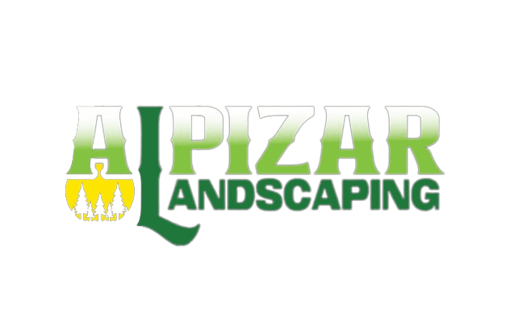

# Alpizar Landscaping Website



A professional website for **Alpizar Landscaping**, a New Jersey-based landscaping company. Built as a lightweight, SEO-optimized, and responsive site with minimal JavaScript, focusing on core HTML/CSS fundamentals.

---

## 📌 Overview
A static website designed to:
- Showcase landscaping services in New Jersey
- Provide contact information and service details
- Prioritize **SEO optimization** and **mobile responsiveness**
- Demonstrate foundational web development skills (early-career project)

> [!IMPORTANT]
> Useful information that users should know 
**Key Highlight**: Developed with simplicity in mind, emphasizing semantic HTML and CSS best practices over complex frameworks.

---

## 🚀 Features
- **SEO Optimization**  
  Meta tags, alt text, and structured data for search engine visibility.
- **Responsive Design**  
  Mobile-first approach with CSS media queries.
- **Lightweight Form Submission**  
  Uses [Formspree](https://formspree.io) (or similar service) to send email notifications to the owner.
- **Performance-Focused**  
  Minimal JS, optimized images, and fast load times.

> [!TIP]
**No JavaScript Fatigue**: Intentional avoidance of JS frameworks to align with project scope and learning goals.

---

## 🛠️ Technical Details

### Tech Stack


### Key Decisions
- **Semantic HTML**: For better accessibility and SEO.
- **CSS Flexbox/Grid**: Modern layout techniques.
- **Static Hosting**: Compatibility with GitHub Pages/Netlify.
- **Zero Dependencies**: No external libraries or frameworks.

> [!caution]  
**Learning Context**: This project reflects early-career development skills. Code structure and practices may differ from advanced implementations.

---

## 🔍 SEO Implementation
- Meta descriptions and title optimization
- Image `alt` attributes for service galleries
- Schema markup for local business (optional)
- Clean URL structure
- Sitemap.xml (if included)

> [!note]  
SEO audits conducted via [Google Lighthouse](https://developers.google.com/web/tools/lighthouse).

---

## 📧 Form Submission Workflow
```plaintext
User Submits Form → Formspree Service → Email Notification to Owner
